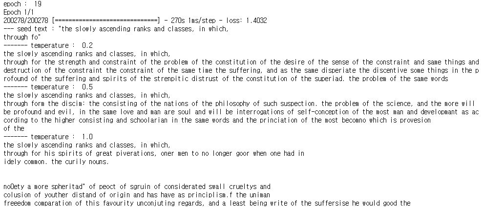

# textgenrnn

[](https://drive.google.com/file/d/1mMKGnVxirJnqDViH7BDJxFqWrsXlPSoK/view)

base : https://github.com/minimaxir/textgenrnn

[textgenrnn](https://github.com/minimaxir/textgenrnn)을 이용하여 shakespeare의 글을 재생산합니다. [Interactive_textgenrnn_Demo.ipynb](https://github.com/Humelo/textgenrnn/blob/master/Interactive_textgenrnn_Demo.ipynb) 파일을 실행시키면 해당 내용을 진행할 수 있습니다. 기본적으로 Keras와 TensorFlow가 설치돼 있어야 합니다.

## 참고

- [YouTube](https://www.youtube.com/watch?v=RW7mP6BfZuY) : 저자가 직접 해당 프로그램을 어떻게 사용하는지 설명하는 동영상입니다. 길이 14분 32초
- [Blog](https://minimaxir.com/2018/05/text-neural-networks/) : 저자가 블로그 포스트로 프로그램을 설명합니다.
- [Githuh](https://github.com/minimaxir/textgenrnn) : 해당 프로그램의 소스코드가 저장된 Github입니다.
- [char-rnn](http://karpathy.github.io/2015/05/21/rnn-effectiveness/) : char-rnn에 대한 참고 문서입니다.

## 모델


## 예시




```
stamp of the state
Of the way of holy days and in her state and his desperate houses
To the duke was strait to leave his heads,
And the one that hath the duke afflicted him to't.

MERCUTIO:
The ghostly sword of Clarence' castle:
I am a pretty reasons, for them all.

DUKE VINCENTIO:
A good world till you have spent thee to the silly woman of the deed was fassed with the people,
And have I with false and a single man.
They say the land will be the duke's company.

CORIOLANUS:
No, I will sleep in this offence to the old
Should some grace to the earth take her own beauty and the sweetest life.

GLOUCESTER:

KING EDWARD IV:
Come, my son, I am not to the prince! O layt, what a wife?

Thireher:
I will stay all the senate, though they do continue the air with him.

HENRY BOLINGBROKE:
Good morrow, and they say that have got the chair of them.

CORIOLANUS:
The prince hath sworn to do the aid of this desire,
That virgin counsels his.

SICINIUS:
We shall not free friends against the way
That can be the day of death did remain
As they were discover'd with our faces,
To serve the best of some shape,
Yet like a tune to see how the sMarce of mine own counsel and the world kings of scerlanding senses repass'd thee and thine own I do
Assest a service of the seal of men,
And she stopp'd the world to the wits.

CLARENCE:
O, no! ay, other, while's nothing stumbled the wealth.

KING EDWARD IV:
Now, brother of York, I am arm'd on comfort
And find it his voices for the consent
That every liege reverence to me be timed,
And thou shalt start a dead man in my father's death.

BUCKINGHAM:
Why, then indeed, madam.

POLIXENES:
Shall they be ready?

ROMEO:
Ay, and so wise and leave me well:
The worst is t holing corse.

ROMEO:
I must away.

CORIOLANUS:
I have seen it the morning, and the hardest
death of the state of traitors.

KING RICHARD II:
Why, here is that take a word with the court.

KING RICHARD II:
Worthy Marcius, I would not show thee;
And therefore the gods be so much in the holy way,--

First Murderer:
A note to bear to be the house of York,
That hath my king and dispersed and stand baches
When they shall not stay thee when they
are better in mine forth three ways and nothing,
And therefore may only dead a man of heaven,
Because how to be a man and mine honour,
When they shall be so redeem'st.

Second Servingman:
What, art thou dead?

JULIET:
It is no father to the duke.

Second Servant:
Well, I will not show the street of these would stay.

QUEEN MARGARET:
The heavens may be sea-it in his course.

MERCUTIO:
Good, is there no more than one should be thine.

ROMEO:
I will not find a soldier.

POLIXENES:
I do beseech you,
I cannot bid him a holy made by the head of mine own,
And say 'We can not the first and strange and all as false flattered,
That seems he fall, as it were a man,
The soul is the man of heaven, be sot,
To send the sun that hath stretch'd her true pursuit?

QUEEN MARGARET:
And so I would reconcile me to the rest.

LUCIO:
Why, a cousin, dear ladder, sleep thereof.

LORD ROSS:
This is the sight; these honours shall be love to fear.

GREEN:
Why, sir, the duke.

PAULINA:
For stands as well advanced and his heads of woe,
That will do me with the clouds,
And then the double story of the duke's company.

CORIOLANUS:
What is
a nighting man to bring him with his sight.

KING EDWARD IV:
Why, then Bolingbroke repass'd to the man.

BAPTISTA:
I would he were better than he should beg;
And we shall not stay to the Lord Antonio on a barbed;
The strange begins to choose the writing of thy faith,
And so he was a tortury-word of sour
Into the breath of the present,
Which perform on him, that cannot entertainness,
The seating of the sea that doth resist my crown more:
The set thou scand for a gates;
And therefore we are better.

NORTHUMBERLAND:
Sir, not the needless courtesy.

BRUTUS:
What, will you go what then?

PROSPERO:
Stay the people,
Which quiced me with his son again.

KING RICHARD II:
You were not a dear to the prince of strange falls,
Without in the sin my daughter who leads it first.

WARWICK:
What is the day's name?

POLIXENES:
I do beseech your honour.

DUKE OF AUMERLE:
My harded sister was the man of his face.

LADY GREY:
No doubt, and go thou hast a heart.

ROMEO:
How now! rame not me good man,
And that the sea shall come to seek the world.

LUCENTIO:
'Tis but here a head, the heirs and hands thine enemy.

VINCENTIO:
What, may one side?

POMPEY:
The most resolve my husband's blood
Which he did bestow thee to his compliments,
When he hath proved by another brother to much be a traitor;
Therefore present yourself have set on me to the court.

PAULINA:
How long is my son?
For now, for my cousin, I do beseech your goose.

LUCENTIO:
I have not the king shall be their liberty.
O God, twices the destroy'd with his son,
Which I do seem to see them and thou hast
And that they do me give him forsworn you.

TRANIO:
Why, so hard of Clarence' death,
And she is wontful of your own life,
And the balm will have himself a man stand upon my face,
And the strange bones of holy father,
That in the good could be seen in mine eyes,
And threaten to the woes of the behalf
That will I not see them and the seas of heaven,
That teach me this man shall be so?

CORIOLANUS:
What then?

CORIOLANUS:
Is the duke? you shall had these towns of his country,
And this my soldier should himself,
And with the honour of a deed posted and see
The sight, and then all the first way where I have seen thee my son,
The faults of the house of Lancaster?

DUKE OF YORK:
Where is that duke? the common time of Menenius,
That he hath drown'd the friend of thee,
That falsehood and that the sight.

CAMILLO:
I do beseech you.

Page:
Ay, and these scouts I pray how
That hence is not beguiled.

MERCUTIO:
Let me speak to presented.

ISABELLA:
I am a man with thee, when I have seen
Content me with their hands: and when I was comforted
To be his son? and the thing is false,
To make her beauty than the world be gracement
That thou hast the man with me here.

BRUTUS:
Now, sir, with that take villain let me show
my sacred strange of the world,
Having the heart of men of anger and friends.

GONZALO:
Either than you be a part of the father's conscience
As they have done the crown?

LADY CAPULET:
Well, what of that?

BRUTUS:
I think the sight of men of heaven shall be so:
The waste did me to see him for this foot.

LUCENTIO:
But marrily, we shall not be so penion our tale,
That there on to return before you can come both toward the fire;
Filling the subject of the strumpets and made
The duke was this doth a single father,
And then I will know that to be a gentleman is my subject,
I will not be so resolved to the compass of the sea, now 'tis a holy prey to great bears
That they must lay the mind of my soul,
And not we shall have the same for the Duke of Buckingham.
You may mean wash my heaven now to be some own life.

PETRUCHIO:
Why, then the state of men and my soul,
And not the strongest of the senate at what thou art a death
And the story deserved of your thirstly love
Is in the world that run shall be the devil's change of the head of the stamp,
Though such a goodly subjects now,
And let them brought this hour execute either death!

QUEEN MARGARET:
Ay, more than I must distempe their company.

Second Gentleman:
No, not a peace of the world.

KING RICHARD III:
Why, how there is that taken my fear,
And with the world and the world but sometimes,
And thou hast not say the lie, the heavens
That they shall see him state, and the strange for the sea,
And heaven to draw our tale and heavens,
Though grant suffer'd yet in the which did stay the world of the world:
The person, that the son of that word to do it, and then am I left from the people's hand,
That that thou ne'er should been some scorn, and son and so!
The steeped shapes of good time.

Provost:
I think he had been with me?

CLIFFORD:
What is the matter, which is thy soldier in the
Towctorm of the precedent or the world,
That thou wouldst affect it with him.

LUCIO:
I pray you, sir, he shall not be no feeling.
Come, come, sir, it determins, are to the prince.

PRINCE:
What like and Tybalt?

PERDITA:
And so I did stay,
Inwer looking on the house of York and be contined

MENENIUS:
I will not skill undone.

KING RICHARD II:
Take heed to speak.

PROSPERO:
They are as it is: 'tis a virtuous
with thy son and be so burning.

MENENIUS:
I would to deny with the heart thereof:
So shall you forget of him, and there is no more.

RICHARD:
I have no more than this heart to death?

KING RICHARD III:
And as the same Pitul, which is your son Lucentio's way
In that of your own growing without confirmation,
I at once deserved; and thou stand from the
service of the world, the young princes.

DUKE OF AUMERLE:
I dare not vain to the right. What says he be?
He was a subject, and that thou hast sold me down the watch fear
Which speak his bed, and so farewell,
When it was the fair of mine purpose.

MERCUTIO:
No, you are enough.

CAMILLO:
Why, sir, the man of his fair sacred stars,
Which are we better to past betwirt to the holy of ourselves.
Or shall we do the desire to her and conveyance,
That thou attend my grave sworn of your eyes
We will not be a thousand body to keep the law.

KATHARINA:
I say she may conceive a barber's king:
This in the heavens, to be a more than he please:
Why then the king is't to the prince;
And when the sea stole of his throne,
That witding such a soldier doth he was a word of him.

PETRUCHIO:
All things are the first window times more than here,
As he were king, and the stuffer's keeper
That thou return'st to besiege our majesty.

KING RICHARD III:
The more of the state, and you'll be set o'er me.

PETRUCHIO:
Now, by Saint Paul, we will not come to your grace.

GLOUCESTER:
My lord, the lady could not speak the sea of thine.

RICHARD:
At this time thou wilt be a holy son and all in the world to the earth,
That being sold weeds as well as an earth to see him bear.

KING LEWIS XI:
What think you of such a slave?

CORIOLANUS:
Wh
```
